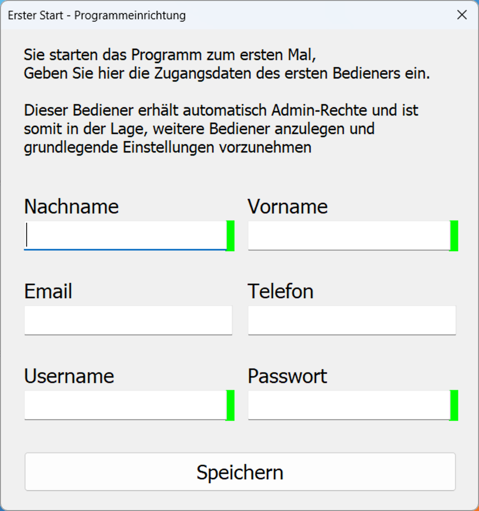
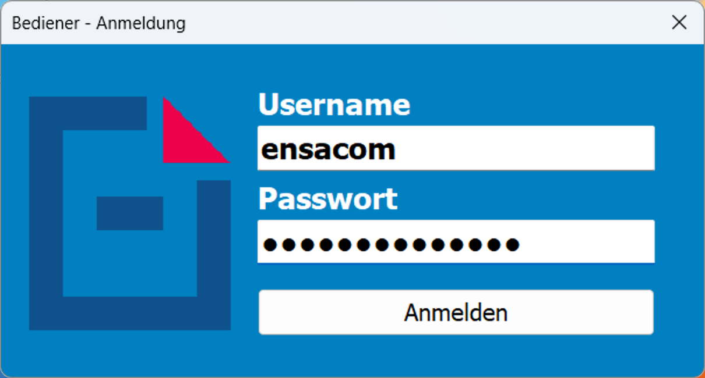
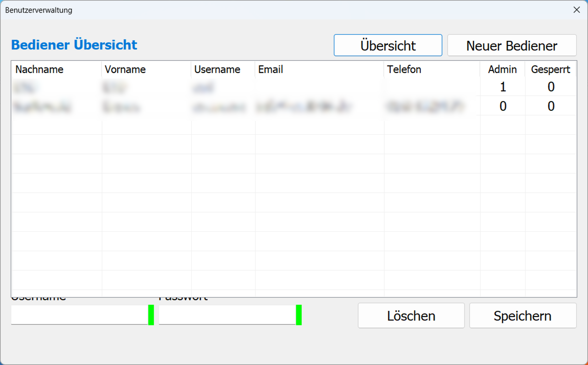
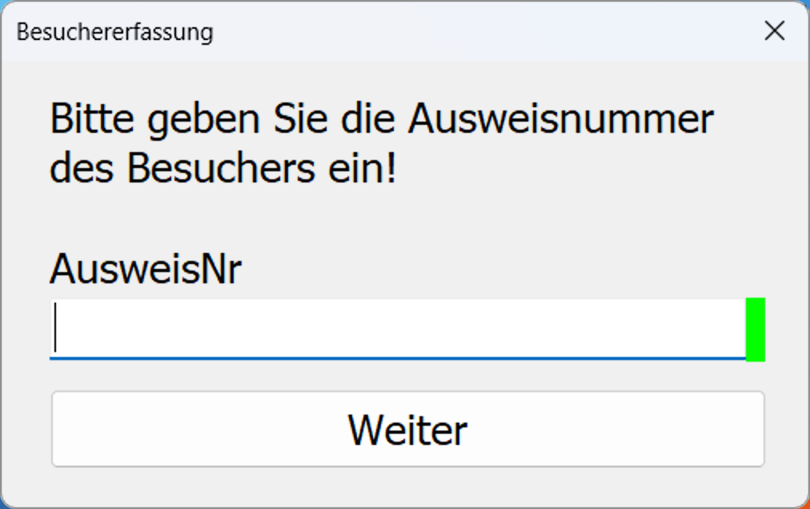
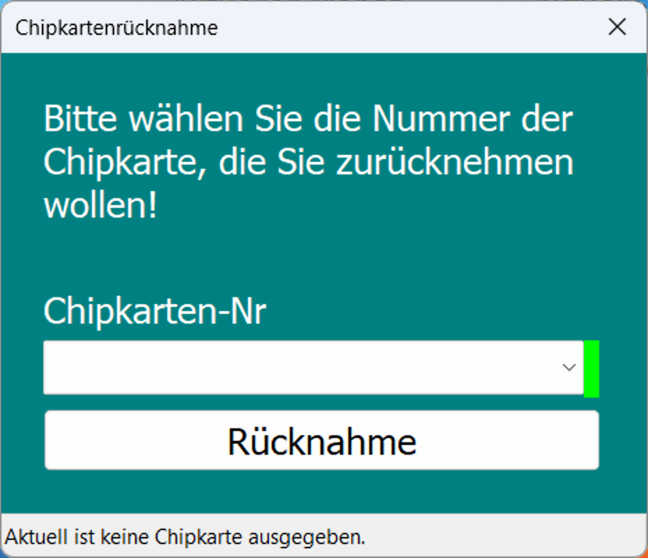
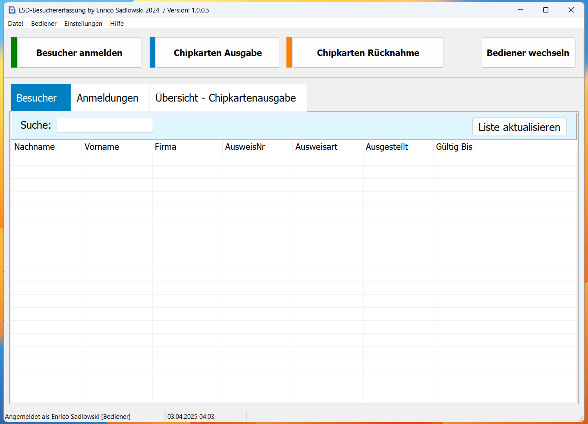

# ESD-Besuchererfassung 1.1.0.6
----

Open Source Delphi-Projekt zur Besucherverwaltung und das erfassen von Chipkartenaus- und 
Rückgaben in Bundeswehrobjekten,  mit SQLite und OpenSSL.

Automatische Datenbanksicherung einmal in der Woche.

## Merkmale

- Plattform: Windows
- Programmiert in: Delphi
- Datenbank: SQLite3
- Verschlüsselung: OpenSSL (libeay32.dll, ssleay32.dll)

## Lizenz

Veröffentlicht unter der MIT-Lizenz“ siehe [LICENSE](./LICENSE).

## Screenshots

**Erster Start:**

**Login Fenster:**

**Bediener - Übersicht:**

**AusweisNr Dialog:**

**Chipkarten Rückgabe:**

**Hauptfenster:**

### ?? Sicherheitsprüfung durch VirusTotal

Diese Anwendung wurde mit über **70 Antivirenprogrammen** bei [VirusTotal.com](https://www.virustotal.com) geprüft.  
? **Es wurden keine Bedrohungen erkannt.**

?? [?? VirusTotal-Ergebnis anzeigen](https://www.virustotal.com/gui/file/d8310e13db1971f533396fc47124035e85affdfd73bb6f01637caf25d7939bfe/details)

---

?? Wenn beim ersten Start eine SmartScreen- oder Defender-Warnung erscheint, klicken Sie einfach auf  
**„Weitere Informationen“ ? „Trotzdem ausführen“** – das Programm ist sicher.
